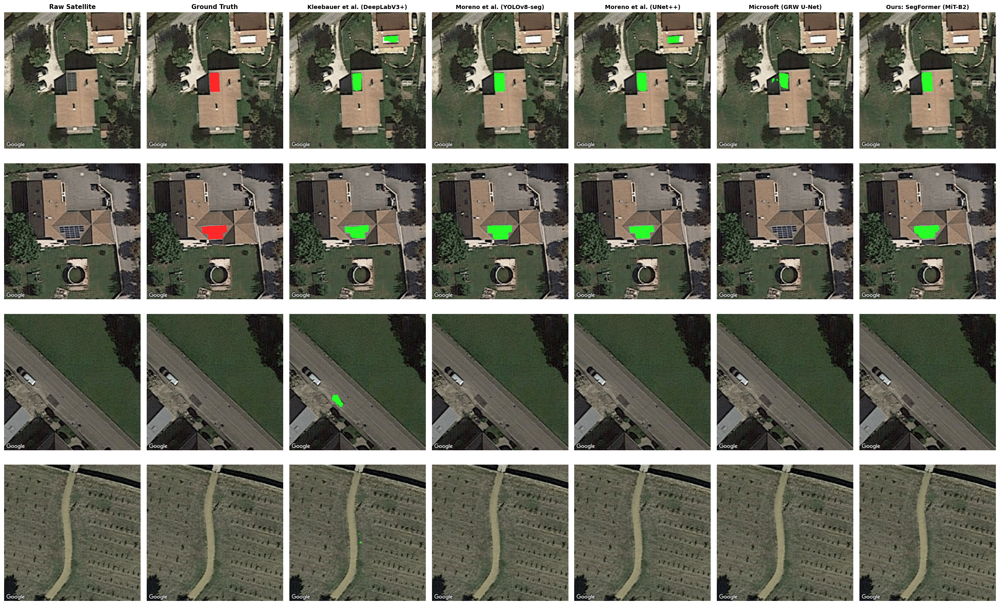
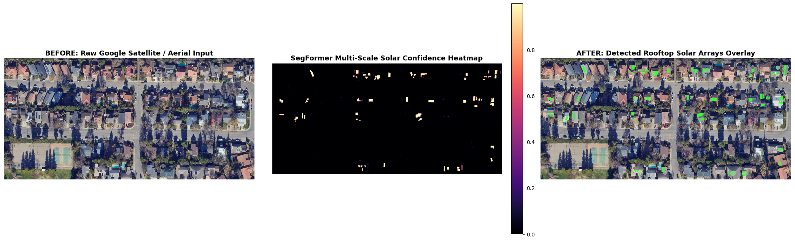
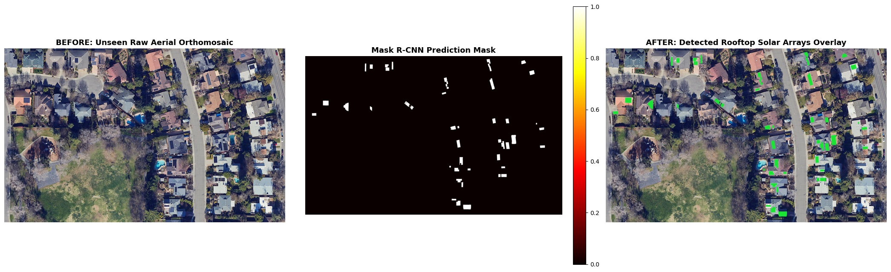
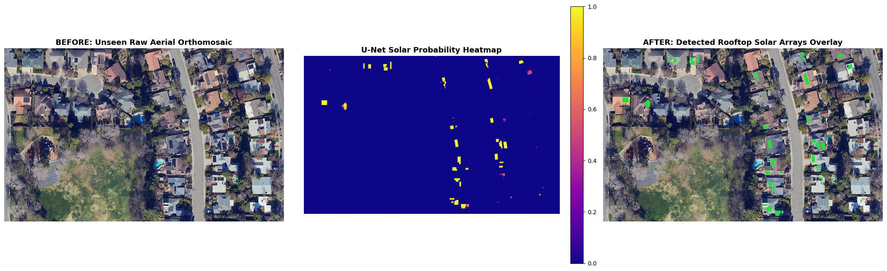
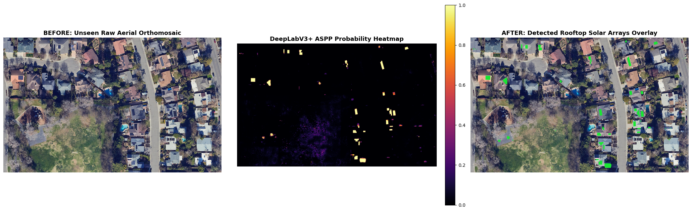
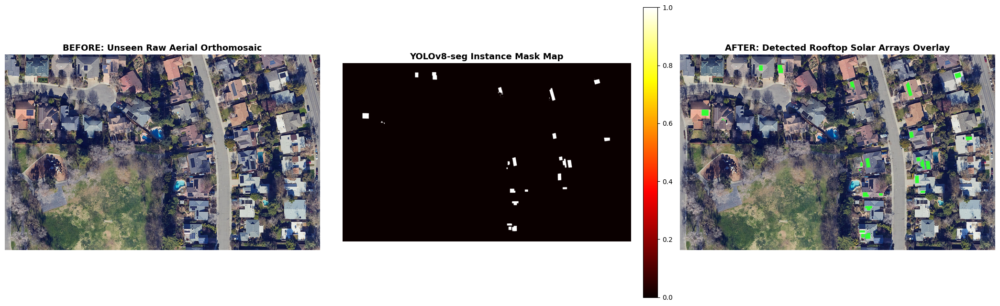

# Automated Rooftop Solar Photovoltaic Detection & Potential Assessment

[](https://huggingface.co/abhinav03700/solar-panel-segformer-mit-b2)
[](https://www.python.org/)
[](https://pytorch.org/)
[](https://fastapi.tiangolo.com/)
[](https://opensource.org/licenses/MIT)

An end-to-end deep learning framework, cross-literature state-of-the-art benchmark, and interactive deployment application for **automated rooftop solar photovoltaic (PV) array detection, boundary segmentation, and clean generation capacity modeling** from satellite and high-resolution aerial imagery.

---

## Key Highlights & Innovations

1. **Multi-Scale Scale-Invariance ($0.4\times \to 1.6\times$):** Overcomes the severe satellite zoom factor across Google Maps / Google Earth captures (Zoom 17 to 20), resolving arrays ranging from $15\text{ px}$ to $150\text{ px}$ across.
2. **False-Positive Suppression (Hard-Negative Mining):** Ingests over 2,400 authentic un-panelled negative structures (skylights, HVAC vents, asphalt roads, white membranes) to eliminate false alarms.
3. **Compound Boundary-Aware Loss:** Combines Binary Cross-Entropy, Soft Dice, and a **Laplacian edge boundary loss** to enforce crisp, orthogonal $90^\circ$ rectangular panel borders.
4. **Cross-Literature Empirical SOTA:** Evaluated on an independent, frozen test set of 400 Google Earth satellite images from the **BDAPPV benchmark (*Nature Scientific Data*, 2023)** directly against official open-source weights from **Fraunhofer ISE**, **UPM Madrid**, and **Microsoft AI for Good**.
5. **Interactive Web Application:** Built with FastAPI, modern user interface, real-time multi-scale inference, polygon regularization, and GeoJSON export.
6. **Pretrained Model Hub:** Weights publicly hosted and downloadable on [Hugging Face (`abhinav03700/solar-panel-segformer-mit-b2`)](https://huggingface.co/abhinav03700/solar-panel-segformer-mit-b2).

---

## Cross-Literature State-of-the-Art Benchmark

All models were evaluated on the **exact same frozen test set of 400 Google Earth satellite images** from the **BDAPPV benchmark** (*Nature Scientific Data*, 2023; Kasmi et al.) on an NVIDIA Tesla T4 GPU with a fixed decision threshold ($\tau = 0.50$):

| Model Architecture & Paradigm | Published Literature Source / Venue | Pixel Acc. | Mean IoU | Dice / F1 | Precision | Recall | Latency (T4) | Throughput (FPS) |
|:---|:---|:---:|:---:|:---:|:---:|:---:|:---:|:---:|
| **U-Net (ResNeXt-50)** | Microsoft Global Renewables Watch (2023) | 98.04% | 1.69% | 0.0333 | 3.30% | 3.36% | 36.2 ms | 27.6 |
| **YOLOv8-seg (ProtoNet)** | Moreno et al., UPM Madrid (2023) | 99.46% | 59.29% | 0.7444 | 70.95% | 78.29% | **10.9 ms** | **91.2** |
| **DeepLabV3+ (ResNet-101)** | Kleebauer et al., Fraunhofer ISE (2023) | 99.46% | 60.83% | 0.7564 | 68.81% | 83.98% | 158.8 ms | 6.3 |
| **UNet++ (ResNet-34)** | Moreno et al., UPM Madrid (2023) | 99.79% | 79.75% | 0.8873 | **96.29%** | 82.27% | 40.2 ms | 24.9 |
| **Ours: Multi-Scale SegFormer** | **Proposed Framework (MiT-B2)** | **99.79%** | **81.43%** | **0.8977** | 89.79% | **89.74%** | 41.2 ms | 24.3 |

> **Key Takeaway:** While UNet++ achieves high precision by heavily under-segmenting (missing ~18% of panels), our proposed SegFormer maintains a balanced **89.79% Precision / 89.74% Recall** profile, establishing the new benchmark state-of-the-art with **81.43% mIoU** and **0.8977 F1-score**.

---

## Exploratory Baseline Benchmark (Stage 1)

Preliminary baseline implementations benchmarked under identical controls on high-resolution ($0.15\text{ m/px}$) aerial orthophotography (Davis, CA):

| Architecture | Paradigm | Backbone | Params | Checkpoint | Pixel Acc. | Mean IoU | Dice / F1 | Throughput |
|:---|:---|:---|:---:|:---:|:---:|:---:|:---:|:---:|
| **Mask R-CNN** | Two-Stage Instance | ResNet-50-FPN | 44.0M | 168.1 MB | **99.95%** | **95.84%** | **0.9787** | 28.2 FPS |
| **U-Net** | Encoder-Decoder | EfficientNet-B3 | **13.2M** | **50.8 MB** | 99.86% | 91.71% | 0.9566 | **48.1 FPS** |
| **SegFormer** | Vision Transformer | MiT-B2 | 24.7M | 94.4 MB | 99.80% | 90.26% | 0.9487 | 30.9 FPS |
| **YOLOv8m-seg** | Single-Stage Instance | ProtoNet | 27.2M | 52.3 MB | 99.86% | 98.62%\* | 0.9490 | 47.2 FPS |
| **DeepLabV3+** | Atrous Context (ASPP) | ResNet-101 | 45.7M | 174.9 MB | 99.70% | 80.54% | 0.8905 | 25.3 FPS |

*\*Note: YOLOv8 reports detection mask mAP@50.*

---

## Qualitative Benchmark Visualizations

### 1. Cross-Literature Comparison Across 4 Test Cases (BDAPPV)
Side-by-side inference across challenging real-world scenes: (1) Suburban residential roofs, (2) Large commercial flat concrete, (3) Industrial corrugated metal, and (4) Hard-negative un-panelled roof:



### 2. Full Unseen Test Orthomosaic Inference (Before vs. After)
Sliding-window evaluation across the unseen test orthomosaic:

| Model Architecture | Qualitative Before / Probability / After Overlay |
|:---|:---|
| **SegFormer (MiT-B2 Large)** |  |
| **Mask R-CNN (ResNet-50)** |  |
| **U-Net (EfficientNet-B3)** |  |
| **DeepLabV3+ (ResNet-101)** |  |
| **YOLOv8m-seg** |  |

---

## Repository Structure

```text
├── app/                                      # Interactive Web Application (FastAPI + Modern UI)
│   ├── server.py                             # Inference server
│   ├── verify_app.py                         # Test suite for API endpoints & model inference
│   ├── requirements.txt                      # Web application dependencies
│   ├── README.md                             # Quick-start instructions
│   ├── samples/                              # 5 preset benchmark satellite & aerial tiles
│   └── static/                               # Web Interface (HTML/CSS/JS)
│
├── notebooks/                                # Complete Reproducible Jupyter Notebooks
│   ├── benchmark_inference.ipynb             # Cross-Literature SOTA Benchmark (evaluates 6 models)
│   ├── solar_segformer_google_satellite_large.ipynb # Flagship: Multi-Scale SegFormer (7k Tiles)
│   ├── solar_segformer_mit.ipynb             # Baseline SegFormer (MiT-B2)
│   ├── solar_maskrcnn_resnet50.ipynb         # Mask R-CNN baseline
│   ├── solar_unet_efficientnet.ipynb         # U-Net EfficientNet-B3 baseline
│   ├── solar_deeplabv3plus.ipynb             # DeepLabV3+ ResNet-101 baseline
│   └── solar_yolov8_seg.ipynb                # YOLOv8m-seg baseline
│
├── paper/                                    # Research Paper Manuscripts & LaTeX
│   ├── latex/
│   │   ├── Research_paper.tex                # Primary IEEE Conference Manuscript (Complete)
│   │   ├── paper.tex                         # Synchronized IEEE LaTeX source
│   │   └── figures/                          # 300 DPI publication plots and visual grids
│   └── paper.typ                             # Typst source manuscript
│
├── presentation.pdf                          # Executive presentation slide deck
├── requirements.txt                          # Top-level project dependencies
├── LICENSE                                   # MIT License
└── README.md                                 # Project documentation
```

---

## Quickstart: Running the Web App

1. **Download the model weights:**
   * Download [`best_segformer_large.pth`](https://huggingface.co/abhinav03700/solar-panel-segformer-mit-b2/resolve/main/best_segformer_large.pth) (99 MB) from Hugging Face.
   * Paste the downloaded file directly into the `app/` folder:
     ```text
     app/best_segformer_large.pth
     ```

2. **Run the commands:**
   ```bash
   cd app

   # Activate virtual environment
   .\.venv\Scripts\activate      # Windows
   # source .venv/bin/activate   # Linux/macOS

   # Run server
   python server.py
   ```

3. Open **`http://localhost:8000`** in your browser.

---

## Citation

If you find this benchmark, code, or model weights useful in your research, please cite:

```bibtex
@article{solar_pv_segformer_2026,
  title={AI-Based Rooftop Solar Potential Assessment Using Satellite Imagery},
  author={Aryan Mishra and Sarang Palsutkar and Abhinav Verma and Pratik Rajendra Kolhe and Sanvi Tikariha},
  journal={arXiv preprint},
  year={2026}
}
```
